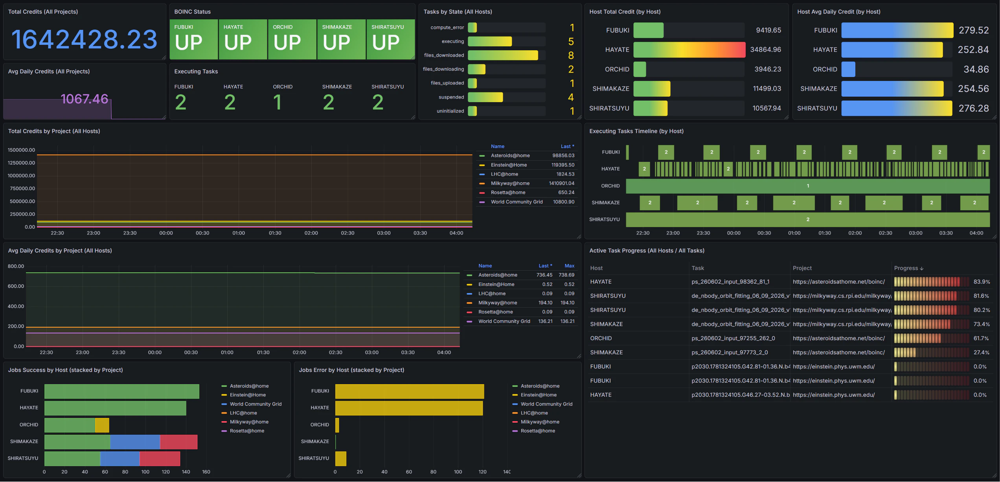

# BOINC Exporter

[](https://github.com/surface0/boinc-exporter/actions/workflows/test.yml)

A Prometheus / VictoriaMetrics exporter for BOINC that collects task status, credits, and project information via the BOINC GUI RPC interface.

[日本語版 README はこちら](README-ja.md)

## Features

- Collects metrics from BOINC clients via GUI RPC (TCP/31416)
- Exposes a Prometheus-compatible `/metrics` endpoint
- Includes a Grafana dashboard
- Docker / docker-compose support
- Multi-host support (scrape multiple BOINC clients independently)

## Metrics

| Metric | Type | Description |
|---|---|---|
| `boinc_up` | Gauge | 1 if the BOINC client is reachable, 0 otherwise |
| `boinc_tasks_total{state}` | Gauge | Number of tasks by state |
| `boinc_task_fraction_done{name,project_url}` | Gauge | Completion fraction (0–1) for executing tasks |
| `boinc_project_total_credit{project,url}` | Gauge | Total accumulated credit per project |
| `boinc_project_avg_credit{project,url}` | Gauge | Recent average daily credit per project |
| `boinc_host_total_credit{project,url}` | Gauge | Total accumulated credit contributed by this host |
| `boinc_host_avg_credit{project,url}` | Gauge | Recent average daily credit contributed by this host |
| `boinc_project_jobs_success_total{project,url}` | Gauge | Total successfully completed jobs |
| `boinc_project_jobs_error_total{project,url}` | Gauge | Total failed jobs |

## Quick Start (docker-compose)

Starts the exporter, VictoriaMetrics, and Grafana together.

```bash
git clone https://github.com/surface0/boinc-exporter.git
cd boinc-exporter

# Set your BOINC GUI RPC password (found in gui_rpc_auth.cfg)
export BOINC_PASSWORD=your_password

docker compose up -d
```

| Service | URL |
|---|---|
| Grafana | http://localhost:3000 |
| VictoriaMetrics | http://localhost:8428 |
| Exporter `/metrics` | http://localhost:9101/metrics |

> **Linux hosts**: The `extra_hosts` setting maps `host.docker.internal` to the host gateway, allowing the exporter to reach a BOINC client running on the host machine.

## Environment Variables

| Variable | Default | Description |
|---|---|---|
| `BOINC_HOST` | `host.docker.internal` | BOINC client hostname or IP |
| `BOINC_PORT` | `31416` | BOINC GUI RPC port |
| `BOINC_PASSWORD` | _(empty)_ | GUI RPC password (empty = no auth) |
| `EXPORTER_PORT` | `9101` | Port the exporter listens on |

## BOINC Client Configuration

To allow remote GUI RPC connections, add the following to `cc_config.xml`:

```xml
<cc_config>
  <options>
    <allow_remote_gui_rpc>1</allow_remote_gui_rpc>
  </options>
</cc_config>
```

The GUI RPC password is stored in `gui_rpc_auth.cfg` (typically `/var/lib/boinc/gui_rpc_auth.cfg`).

## Manual Installation

```bash
pip install -r requirements.txt
pip install -e .

export BOINC_HOST=localhost
export BOINC_PASSWORD=your_password

boinc-exporter
# or
python -m boinc_exporter
```

## Grafana Dashboard



The dashboard at `grafana/dashboards/boinc.json` is automatically provisioned when using docker-compose, or can be imported manually into Grafana.

### Panels

| Panel | Description |
|---|---|
| BOINC Status | Connection state per host |
| Total Credits | Sum of credits across all projects |
| Avg Daily Credits | Sum of average daily credits across all projects |
| Executing Tasks | Number of running tasks per host |
| Tasks by State | Task counts aggregated across all hosts |
| Active Task Progress | Progress table for all executing tasks (all hosts) |
| Total Credits by Project | Credit history per project (all hosts aggregated) |
| Avg Daily Credits by Project | Daily credit history per project (all hosts aggregated) |
| Jobs Success by Project | Successful job counts per project |
| Jobs Error by Project | Failed job counts per project |

## DockerHub

```bash
docker pull seizu/boinc-exporter
```

To publish a new release:

```bash
git tag v1.0.0
git push --tags
# GitHub Actions will build and push to DockerHub automatically
```

## Development

```bash
# Install dependencies
pip install -r requirements-dev.txt
pip install -e .

# Run tests
python -m pytest -v

# Run tests with coverage
python -m pytest --cov=boinc_exporter --cov-report=term-missing
```

## License

MIT — see [LICENSE](LICENSE)
